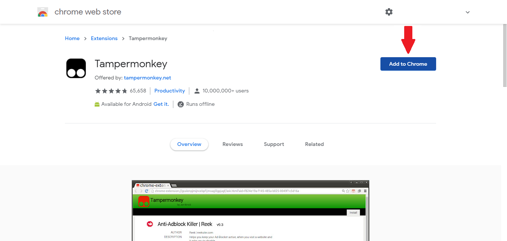
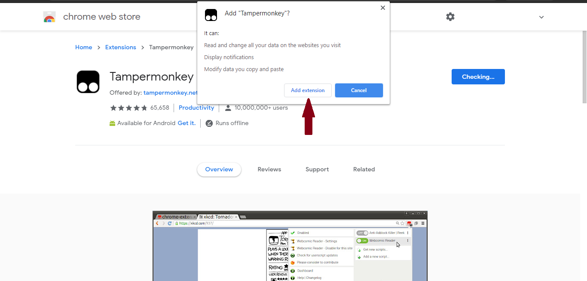
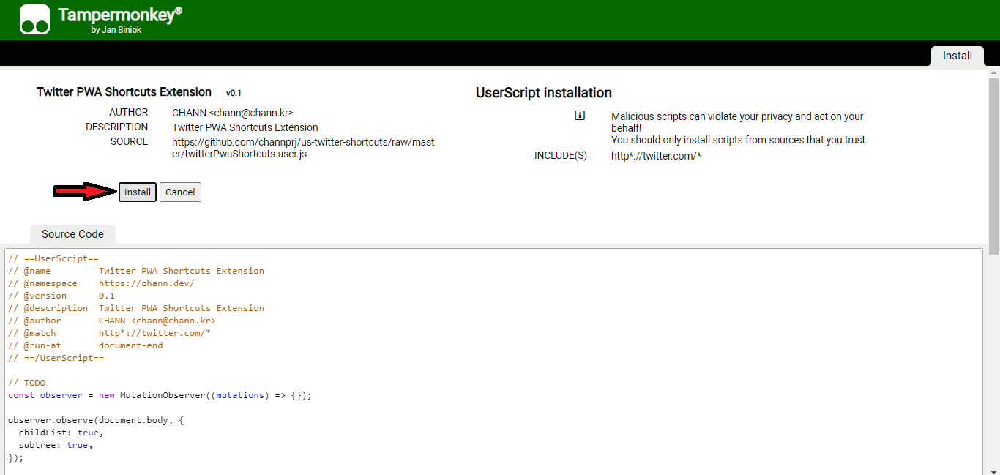

# Twitter Extension

Use more keyboard shortcuts and override styles. This UserScript enhance

## How to Use

> **Step1:** You will need a browser extension for loading UserScript. To add extension `click` on the `web browser icon` below, which you are using :

|  Edge |  Firefox |  Chrome |  Safari |  Opera |
| ------------------------------------------------------------------------------------------------------------------------------------------------------------------------------------------------------------------------------------------- | --------------------------------------------------------------------------------------------------------------------------------------------------------------------------------------------------------------------------- | -------------------------------------------------------------------------------------------------------------------------------------------------------------------------------------------------------------------------------------- | ------------------------------------------------------------------------------------------------------------------------------------------------------------------------------------------------------------------- | -------------------------------------------------------------------------------------------------------------------------------------------------------------------------------------------------------------------------- |
| Edge 79+                                                                                                                                                                                                                                    | Firefox 52+                                                                                                                                                                                                                 | Chrome 31+                                                                                                                                                                                                                             | Safari 12+                                                                                                                                                                                                          | Opera 15+                                                                                                                                                                                                                  |

### Chrome example:

1. Click _Add to Chrome_
   
1. Add extension
   

> **Step2:** To install this UserScript, simply `click` the `install button` below, or go to the "twitterExtension.user.js" file in the repository and click the "Raw" button in the top right. Your UserScript extension should recognize the script and ask if you would like to install it.

Finally, click on **Install** button and enjoy! :-)

