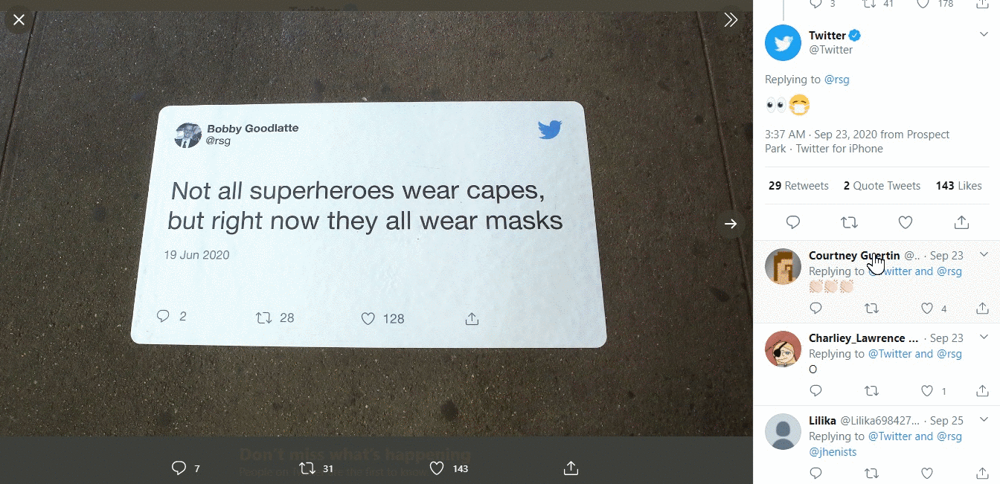
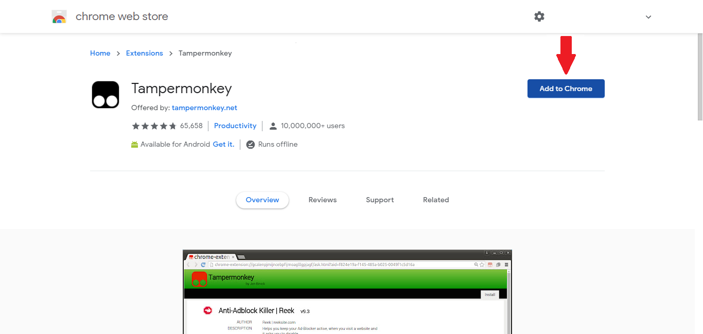
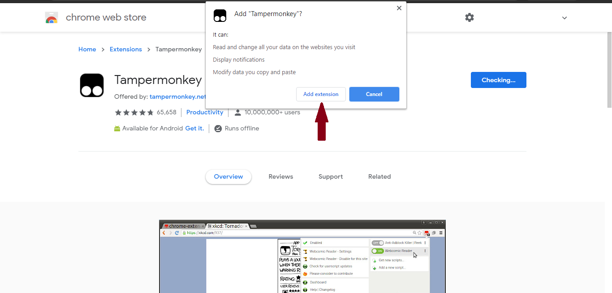
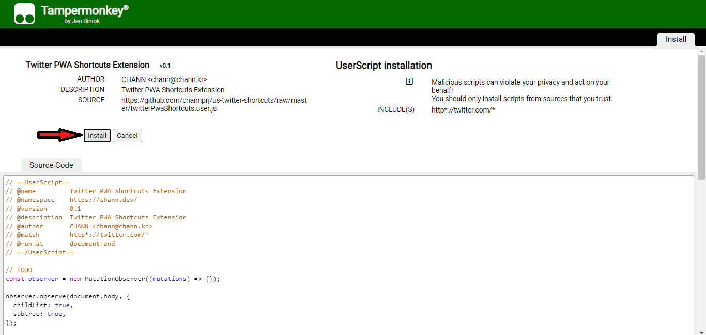

# Twitter Shortcuts

It is often very difficult to hover to the back button again and again after moving to some other page on twitter.
This script makes life easy by moving to the home page by just clicking **Esc** button on the keyboard once.
  

## How to Use

>**Step1:** You will need a browser extension for loading userscripts. To add extension `click` on the `web browser icon` below, which you are using :

|  Edge |  Firefox |  Chrome |  Safari |  Opera |
| --- | --- | --- | --- | --- |
| Edge 79+ | Firefox 52+ | Chrome 31+ | Safari 12+ or MacOS 10.13+ | Opera 15+ |

### Chrome example:
1. Click on add to chrome
    
2. Add extension
     
    
 

>**Step2:** To install the userscript, simply `click` the `install button` below, or go to the ".user.js" file in the repository and click the "Raw" button in the top right. Your userscript extension should recognize the script and ask if you would like to install it.

Now, click on Install button and then you are good to go.

